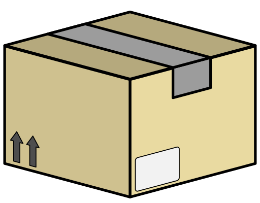

[crates-io]: https://crates.io/crates/channels
[docs-rs]: https://docs.rs/channels/latest/channels
[github-actions]: https://github.com/threadexio/channels-rs/actions/workflows/ci.yaml

[license-badge]: https://img.shields.io/github/license/threadexio/channels-rs?style=for-the-badge&logo=github&label=license&labelColor=%23000&color=%236e00f2
[tests-badge]: https://img.shields.io/github/actions/workflow/status/threadexio/channels-rs/ci.yaml?style=for-the-badge&logo=github&label=tests&labelColor=%23000&color=%239500d6
[version-badge]: https://img.shields.io/crates/v/channels?style=for-the-badge&logo=rust&label=crates.io&labelColor=%23000&color=%23bc00ba
[docs-badge]: https://img.shields.io/docsrs/channels?style=for-the-badge&logo=docs.rs&labelColor=%23000&color=%23e2009e
[downloads-badge]: https://img.shields.io/crates/d/channels?style=for-the-badge&label=downloads&labelColor=%23000&color=%23ff0089

  

  

    Easy and fast communication between processes, threads and systems.
  

  [![license-badge]][crates-io]
  [![version-badge]][crates-io]
  [![downloads-badge]][crates-io]

  [![tests-badge]][github-actions]
  [![docs-badge]][docs-rs]

 

Sender/Receiver types for communicating with a channel-like API across generic IO streams. It takes the burden on serializing, deserializing and transporting data off your back and let's you focus on the important logic of your project. It is:

- **Fast**: The simple protocol allows lower-overhead parsing of data.

- **Minimal**: Channels can be used in `no_std` environments with only a memory allocator.

- **Light**: Channels' low memory usage means it can run in constrained embedded environments.

# How it works

Channels implements a communication protocol that allows sending and receiving data across any medium. It works over _any_ stream synchronous or asynchronous. Currently it can work with any of the following IO traits:

- [`std::io::{Read, Write}`](https://doc.rust-lang.org/stable/std/io)
- [`tokio::io::{AsyncRead, AsyncWrite}`](https://docs.rs/tokio/latest/tokio/io)
- [`futures::io::{AsyncRead, AsyncWrite}`](https://docs.rs/futures/latest/futures/io)

You can find out more about how the underlying communication protocol works [here](./spec/PROTOCOL.md).

# Examples

See: [examples/](https://github.com/threadexio/channels-rs/tree/master/examples)

# License

- All code in this repository is licensed under the MIT license, a copy of which can be found [here](./LICENSE).

- All artwork in this repository is licensed under [Creative Commons Attribution-NonCommercial 4.0 International](https://creativecommons.org/licenses/by-nc/4.0/). A copy of the license can be found [here](./.github/images/LICENSE).
